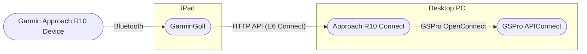

# Reverse Engineering The Approach R10's Bluetooth

My setup is, like I imagine most DIY home golf simulators are, complicated. I use a Garmin Approach R10 connected via Bluetooth to an iPad running the GarminGolf app. Then I connect GarminGolf to the [Approach R10 Connect](/tools/approach-r10-connect/) app, over the E6 Connect API. Which forwards shot data to GSPro using their [OpenConnect](https://gsprogolf.com/GSProConnectV1.html) API.

Phew! Have your eyes glazed over yet? If so, I put together a diagram that shows the setup I described above.

It really seems silly to have to run all this just to forward shot data from one device to another. There's far too many points of failure. So I'd like to try and simplify things. My PC has bluetooth capability, and if Garmin was cooler, they would release some documentation on how to better integrate things, but alas, we must retreat to our mylar lined basement and try and hack our way around this problem. If we could intercept the different bluetooth messages sent to and from the Approach R10 device and the GarminApp, we could, in theory cut out the entire iPad part of this process, and handle the bluetooth pairing and communication directly from the PC running the Approach R10 Connect app.

That's the plan at least. I'll try and keep this article updated with my progress.

Links:

- https://twocanoes.com/knowledge-base/capture-bluetooth-packet-trace-on-ios/
- https://www.bluetooth.com/blog/a-new-way-to-debug-iosbluetooth-applications/
- https://wiki.wireshark.org/CaptureSetup/Bluetooth
- https://github.com/OpenFenix/bluetooth-sniffer
