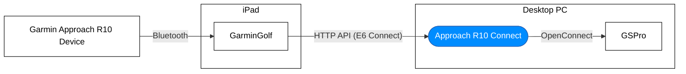

{: .error }

> ⚠️ This project is no longer in development or maintained. I highly recommend you check out the [gsp-r10-adapter](https://github.com/mholow/gsp-r10-adapter) project instead, which allows directly bluetooth paring. I've left this article here for archive purposes only.

**Approach R10 Connect** is an open-source Windows application that acts as a bridge for connecting your [Garmin Approach R10](https://www.garmin.com/en-US/p/695391){:target="\_blank"} Launch Monitor with the [GSPro Golf Simulator](https://gsprogolf.com/){:target="\_blank"}.

## Approach R10 Connect Setup

Download the `.exe` file from the releases page, and follow the instructions to install it.

Once you have everything downloaded and installed, go ahead and open the app for the first time.

{: .warning }

> ⚠️ Windows may warn about this software coming from an untrusted developer. For now, you'll need to click **More Info > Run anyway**, until we've setup code signing.

Once open, you should see two statuses. One for GSPro and another for the Approach R10. At this point, they are likely both displaying **Disconnected**. Follow the guides below to get both connected.

[View Source on GitHub](https://github.com/dudewheresmycode/gspro-openconnect-approach-r10){: .btn }

### How It Works

